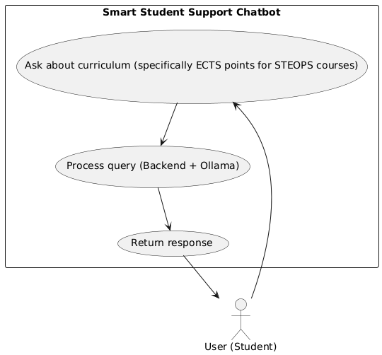
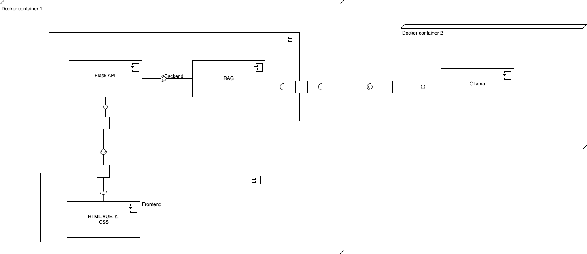
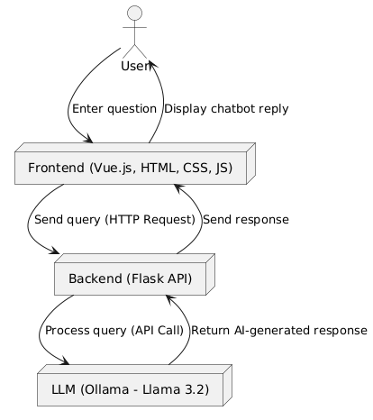
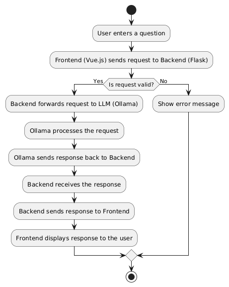
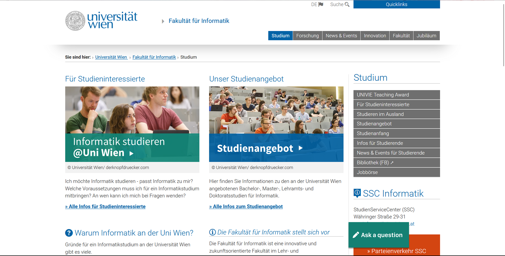
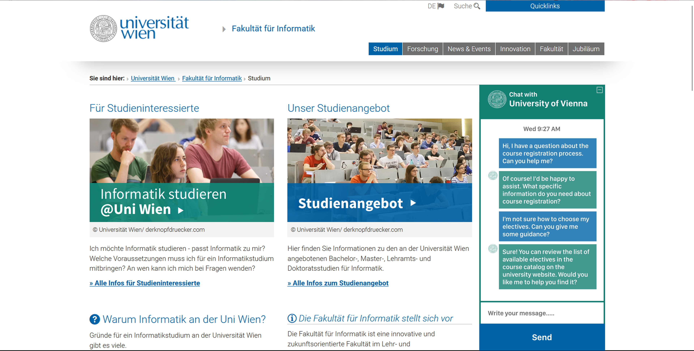
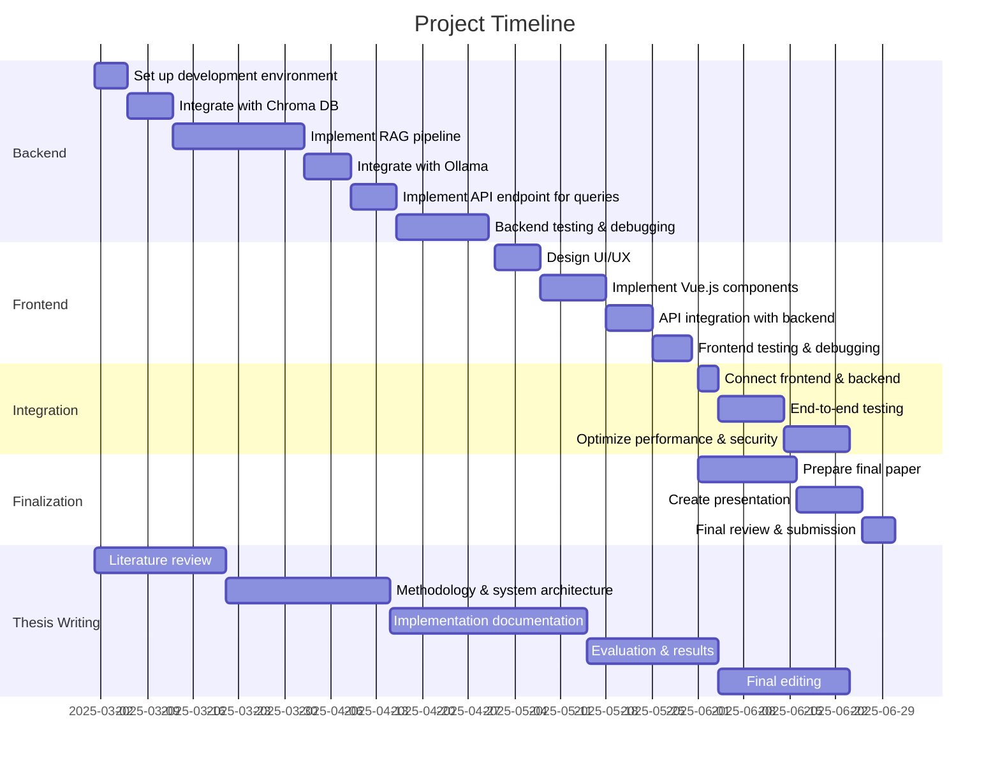

# Application Overview and Objectives
## Table of Contents  
1. [Application Overview and Objectives](#application-overview-and-objectives)  
2. [Use Cases](#use-cases)  
3. [Architecture](#architecture)  
4. [Project Management](#project-management)  

## Application Overview
The PK16 - Smart Student Support Chatbot is an AI-powered assistant designed to provide students with quick and accurate information about curriculum details, faculty members, and various academic resources. These resources include data from the university portal u:find, which provides curriculum information as well as a directory of persons and organizations, subunits, and research groups (including contact details, addresses, websites, and team structures). Additionally, the chatbot will provide information about the faculty dean's office (contact details, address, team), professors and staff (contact details, addresses, positions, and subjects they teach), as well as the Student Service Center for Computer Science, which offers insights into study programs, research activities, news, events, and faculty-related updates.

The chatbot will also provide access to detailed curriculum information for various study programs, including:
#### Bachelor’s Programs:
- Informatik (521 [5] - Version 2022)
- Wirtschaftsinformatik (526 [3] - Version 2016)
- Lehramt UF Digitale Grundbildung und Informatik (193 053 [2], 198 414 [2])

 #### Master’s Programs:
- Bioinformatik (875 [1])
- Data Science (645 [1])
- Informatik (921 [2] - Version 2022)
- Medieninformatik (935 [3] - Version 2022)
- Wirtschaftsinformatik (926 [2] - Version 2016)
- Lehramt UF Digitale Grundbildung und Informatik (196 053 [2], 199 514 [2] - Version 2024)

#### Phasing-Out Programs:
- Bachelor Informatik (521 [4] - Version 2016)
- Bachelor Informatik - Data Science (521 [4] - Version 2016)
- Bachelor Informatik - Medieninformatik (521 [4] - Version 2016)
- Bachelor Informatik - Medizininformatik (521 [4] - Version 2016)
- Bachelor Informatik - Scientific Computing (521 [4] - Version 2016)
- Bachelor Lehramt UF Informatik (193 053 [1], 198 414 [1])
- Master Lehramt UF Informatik (196 053 [1], 199 514 [1])

The chatbot is deployed in a microservices architecture susing Docker.

_What are the purpose and the scope of the application?_

- The chatbot is intended to provide 24/7 automated support to students regarding academic queries
- Reduce dependency on administrative staff by handling frequently asked questions
- Improve the efficiency of information retrieval related to course structures, faculty details, and university policies

_Who is the target audience (users)?_

The primary users of the chatbot are:

- University students seeking quick access to curriculum details, faculty contacts, and administrative information.
- Prospective students researching course details before enrollment.
- Faculty members & administration who want to ensure students receive accurate information without manual intervention.

Example queries that the chatbot can handle include:

- "What courses are included in the Bachelor’s program in Informatics (Version 2022)?"
- "Who is the head of the Data Science research group?"
- "Where can I find the contact details for the Faculty Dean's office?"
- "Which professor is responsible for the MOD lecture?"
- "Are there any upcoming events or news related to the Computer Science faculty?"
- "What are the admission requirements for the Master’s program in Bioinformatics?"

## Objectives

_Break down the application overview description into a list of
functional (and possibly non-functional) high-level application
requirements._

It should be a chat on the right side of the website that looks like a chat interface and answers questions about the Computer Science faculty.

Functional Requirements:
1. Student Query Handling
* 1.1 The chatbot shall accept user input in the form of natural language questions via a text-based chat interface.
* 1.2 The chatbot shall provide relevant answers to student queries regarding curriculum details, faculty contacts, and administrative information (see example queries above).
* 1.3 The chatbot shall retrieve and display information from university resources such as u:find and the Student Service Center.
* 1.4 The chatbot shall maintain a conversational context for at least three turns, remembering previous user inputs within the same session.
* 1.5 The chatbot shall handle follow-up questions and provide clarification when requested.
* 1.6 The chatbot shall recognize and respond appropriately to both academic and administrative queries.

2. Natural Language Understanding (NLU) Support

* 2.1 The chatbot shall process user queries using Natural Language Processing (NLP) techniques to extract intent and relevant information.
* 2.2 The chatbot shall handle variations in phrasing and minor grammatical errors in user input.
* 2.3 The chatbot shall support multilingual query handling (english and german).
3. User Interface and Accessibility

* 3.1 The chatbot shall be accessible via a web-based interface, allowing students to interact through a browser.
* 3.2 The chatbot shall have an intuitive and user-friendly chat interface with a clear display of responses.
4. Near Real-Time Communication

* 4.1 The chatbot shall provide responses to user queries with minimal delay, ensuring a near real-time interaction experience.

Non-Functional Requirements: 
1. Performance & Response Time

* 1.1 The chatbot shall respond to user queries within an average of 5-10 seconds under normal operating conditions. The response time may vary depending on the performance of the machine on which the program is running.
* 1.2 The chatbot should be able to handle at least 20 concurrent users without significant performance degradation. The response time may vary depending on the performance of the machine on which the program is running.
2. Reliability & Availability

* 2.1 The chatbot shall be available 99% of the time, ensuring minimal downtime.
* 2.2 The chatbot shall be designed to gracefully handle system failures by providing fallback responses. 
3. Ease of Maintenance & Extensibility

* 3.1 The chatbot’s knowledge base shall be easily updatable without requiring code changes, allowing administrators to add or modify information dynamically.
* 3.2 The system shall support modular updates, enabling improvements to the AI model, frontend, and backend components independently.
* 3.3 The chatbot shall allow integration with additional university services and APIs without major architectural changes.

4. Usability

* 4.1 The chatbot shall have an intuitive and user-friendly interface, ensuring ease of use for students and faculty members.
* 4.2 The chatbot shall support clear and structured responses, reducing ambiguity in answers.
* 4.3 The chatbot's interface shall maintain a consistent design and layout with other university resources, including u:find, SSC, u:space, and the official faculty website, ensuring a familiar user experience.

# Use Cases

## Roles and Actors (if applicable)

_This section lists the roles interacting with the application and
provides a short description. Add identified / possible roles and actors
for your application here._

1. Student (Primary User): Students interact with the chatbot to get information about courses, faculty members, schedules, and general university policies.
2. Prospective Student: they can ask questions about faculty, steops, ECTS points for subjects ect.
3. Faculty Member: Faculty members may use the chatbot to check course details or provide feedback on the chatbot’s accuracy.

## Use Case Diagrams

_Provide an UML Use-Case diagram that illustrates the use cases of your
application and their relationship with the previously defined
roles/actors. My recommendation: PlantUML_

Use Cases and Actors:

User: Interacts with the chatbot to get information about the curriculum, lecturers, and other academic details.
- Use Case 1 (UC-001): Ask about curriculum and lectures: User asks for details about courses, subjects, or requirements.
- Use Case 2 (UC-002): Rephrase query: User reformulates the query if the chatbot did not understand the question.
- Use Case 3 (UC-003): Request additional information: User asks for more details about the course.

## Textual Use Case Descriptions

_Add textual use case descriptions for each use case defined in the Use
Case Diagram. Use the provided form:_

| Category              | Entry            |
| --------------------- | ---------------- |
| Use Case ID           | UC-001  |
| Title                 | Ask a question in the chat |
| Scope                 | Whole System |
| Short Description     | Allows a user to ask a question about the Computer Science faculty.|
| Precondition          | User is able to navigate to the chatbot located at the bottom-right side of the website.|
| Actors                | User |
| Trigger               | User enters a question and clicks the "Send" button.|
| Main Success Scenario | 1. User enters a question.   2. System processes the input.   3. System generates an answer.     4. System displays the respone in the chat.|
| Success Guarantees    | 1. The user receives a response.|
| Exceptions            | No exceptions should occur. The chatbot should always attempt to send a response. |
| Issues/Comments       | The knowledge base may not be comprehensive enough to answer all user questions correctly.|

| Category              | Entry            |
| --------------------- | ---------------- |
| Use Case ID           | UC-002 |
| Title                 | Rephrase query |
| Scope                 | Whole System |
| Short Description     | User reformulates the query if the chatbot does not understand the question.|
| Precondition          | User has already asked a question. The chatbot has generated a response, but the user needs to clarify the information.|
| Actors                | User |
| Trigger               | User reformulates the question, enters the revised text in the chatbot, and clicks the "Send" button.|
| Main Success Scenario | 1. User reformulates the question.   2. System processes the input.   3. System generates an answer    4. System displays the respone in the chat.             |                 |
| Success Guarantees    | 1. The user receives a response with the needed information.|
| Exceptions            | No exceptions should occur. The chatbot should always attempt to send a response. |
| Issues/Comments       | The user should receive more specific information based on their revised query. |

| Category              | Entry            |
| --------------------- | ---------------- |
| Use Case ID           | UC-003 |
| Title                 | Request additional information |
| Scope                 | Whole System |
| Short Description     | User asks for more details about a course.|
| Precondition          | User has previously had a conversation with the chatbot about this course.|
| Actors                | User                 |
| Trigger               | User requests additional details about a specific course. |
| Main Success Scenario | 1. User asks for more information about a previously mentioned course.   2. System processes the input.   3. System generates an answer    4. System displays the respone in the chat.             |                 |                 |
| Success Guarantees    | 1. The user receives more detailed information about the course.|
| Exceptions            | No exceptions should occur. The chatbot should always attempt to send a response.|
| Issues/Comments       | The user should receive more comprehensive details about the specific course. |

## 1. Course Details category
| Category              | Entry                                                  |
|---------------------- |------------------------------------------------------ |
| **Use Case ID**       | UC-004                                               |
| **Title**            | Retrieve Course Details (e.g., Prerequisites)        |
| **Scope**            | Whole System                                          |
| **Short Description** | User asks for details about a course, such as prerequisites. |
| **Precondition**     | User is able to navigate to the chatbot located at the bottom-right side of the website. |
| **Actors**           | User                                                  |
| **Trigger**          | User enters a question and clicks the "Send" button.  |
| **Main Success Scenario** | 1. User asks for information about a specific course (e.g., prerequisites).   2. System processes the input.   3. System generates an answer.   4. System displays the response in the chat. |
| **Success Guarantees** | 1. The user receives the requested course information (e.g., "The prerequisites for PR2 are StEOP courses."). |
| **Exceptions**       | If no information is available for a specific course, the chatbot should respond with a message like, "I don't have information about this course." |
| **Issues/Comments**  | The user should receive information about a specific course if it is available in the database or context. |

## 2. Lecturer information category

| Category              | Entry                                                  |
|---------------------- |------------------------------------------------------ |
| **Use Case ID**       | UC-005                                               |
| **Title**            | Find Lecturer Information (e.g., contact details)     |
| **Scope**            | Whole System                                          |
| **Short Description** | User asks for information about a lecturer (e.g., contact details, such as email). |
| **Precondition**     | User is able to navigate to the chatbot located at the bottom-right side of the website. |
| **Actors**           | User                                                  |
| **Trigger**          | User enters a question and clicks the "Send" button.  |
| **Main Success Scenario** | 1. User asks for information about a lecturer (e.g., contact details).   2. System processes the input.   3. System generates an answer.   4. System displays the response in the chat. |
| **Success Guarantees** | 1. The user receives the information about the lecturer (e.g., "Professor X has the following email address..."). |
| **Exceptions**       | If there is no information about a specific lecturer, the chatbot should respond with a message like, "I don't have information about this lecturer." |
| **Issues/Comments**  | The user should receive information about the specific lecturer if they are mentioned in the database or context. |

## 3. General question about Curriculum category

| Category              | Entry                                                  |
|---------------------- |------------------------------------------------------ |
| **Use Case ID**       | UC-006                                               |
| **Title**            | Find General Curriculum Information (e.g., about ECTS) |
| **Scope**            | Whole System                                          |
| **Short Description** | User asks for general information about the curriculum (e.g., ECTS points). |
| **Precondition**     | User is able to navigate to the chatbot located at the bottom-right side of the website. |
| **Actors**           | User                                                  |
| **Trigger**          | User enters a question and clicks the "Send" button.  |
| **Main Success Scenario** | 1. User asks for general information about a curriculum (e.g., the total number of ECTS credits in a Bachelor's program).   2. System processes the input.   3. System generates an answer.   4. System displays the response in the chat. |
| **Success Guarantees** | 1. The user receives information about the curriculum (e.g., "The Bachelor's degree in Computer Science requires 180 ECTS credits."). |
| **Exceptions**       | If there is no information available for a specific question, the chatbot should respond with a message like, "I don't have this information." |
| **Issues/Comments**  | The user should receive information about general curriculum-related questions if they are available in the database or context. |

## 4. SSC category

| Category              | Entry                                                  |
|---------------------- |------------------------------------------------------ |
| **Use Case ID**       | UC-007                                               |
| **Title**            | Find Information About SSC (e.g., Opening Times) |
| **Scope**            | Whole System                                          |
| **Short Description** | User asks for information about the StudienServiceCenter (SSC), such as opening times. |
| **Precondition**     | User is able to navigate to the chatbot located at the bottom-right side of the website. |
| **Actors**           | User                                                  |
| **Trigger**          | User enters a question and clicks the "Send" button.  |
| **Main Success Scenario** | 1. User asks for information about the SSC (e.g., its opening hours).   2. System processes the input.   3. System generates an answer.   4. System displays the response in the chat. |
| **Success Guarantees** | 1. The user receives information about the SSC (e.g., "Mon - Thu: 9:00 - 14:00, Fri: 9:00 - 13:00"). |
| **Exceptions**       | If there is no information available for the SSC, the chatbot should respond with a message like, "I don't have this information." |
| **Issues/Comments**  | The user should receive information about SSC-related questions if they are available in the database or context. |

## 5. Lactures (Subjects) category:

| Category              | Entry                                                  |
|---------------------- |------------------------------------------------------ |
| **Use Case ID**       | UC-008                                               |
| **Title**            | Find Information About a Lecture (e.g., Goal of the Lecture) |
| **Scope**            | Whole System                                          |
| **Short Description** | User asks for information about a lecture, such as its goal. |
| **Precondition**     | User is able to navigate to the chatbot located at the bottom-right side of the website. |
| **Actors**           | User                                                  |
| **Trigger**          | User enters a question and clicks the "Send" button.  |
| **Main Success Scenario** | 1. User asks for information about a specific lecture (e.g., its goal).   2. System processes the input.   3. System generates an answer.   4. System displays the response in the chat. |
| **Success Guarantees** | 1. The user receives relevant information about the lecture (e.g., "Students are familiar with the historical development and understand the structure and functionality of today's digital computers. They can name, describe, and explain the key features of computer architectures, such as computer structure, performance, pipelining, caching, virtual memory, and I/O."). |
| **Exceptions**       | If no information is available for the lecture, the chatbot should respond with a message like, "I don't have this information." |
| **Issues/Comments**  | The user should receive information about lecture-related questions if they are available in the database or context. |

# Architecture

## Overview

_Identify and describe the main application components and their
interdependencies. If applicable, illustrate them using an UML component diagram._

The project consists of three main components, deployed in two Docker containers for modularity and scalability. These components work together to provide a seamless chatbot experience for students.
Main Components and Their Interdependencies:

1. Backend (Python Flask) & Frontend (Vue.js, HTML, CSS, JavaScript)
        The backend, built with Python Flask, handles HTTP requests from the frontend and interacts with the LLM (Ollama) for generating responses.
        The frontend, developed with Vue.js, provides an intuitive chat-like interface for users. It sends user queries to the backend via REST API calls and displays chatbot responses dynamically.
        Both backend and frontend are deployed within the same Docker container to simplify deployment and communication.

2. LLM - Ollama (Llama 3.2)
        This component is responsible for natural language processing (NLP) and response generation.
        Hosted in a separate Docker container, it ensures scalability and easy updates to the AI model without affecting other components.
        The backend communicates with Ollama through API calls to retrieve intelligent, context-aware answers for user queries.

        
The frontend (Vue.js) sends a request to the endpoint /api/user-request, containing the user's query. To store knowledge, we use a vector-based database (Chroma). The user’s query is processed to retrieve the top-k relevant matches (e.g., k = 5) from the database. These matches, along with the user’s original question, form the context sent to Ollama for processing. This approach, known as Retrieval-Augmented Generation (RAG), is implemented using LangChain tools.

Ollama generates a response based on the provided context, which is then returned to the frontend via the Flask API.

To expand the knowledge base, we use a sources.json file, where we define all relevant websites and file paths. A Python script processes these sources before users can submit queries. This method allows us to dynamically extend the knowledge base without major code modifications—simply by updating sources.json.

Deployment Architecture (Docker-Based)

- Docker Container 1: Backend (Flask) + Frontend (Vue.js)
- Docker Container 2: Ollama (Llama 3.2) for AI responses

Component Interaction Flow:

1. User inputs a query in the chat interface (frontend).
2. The frontend (Vue.js) sends the request to the backend (Flask).
3. The backend processes the request and forwards it to Ollama (Llama 3.2).
4. Ollama generates a response and sends it back to the backend.
5. The backend relays the response to the frontend.
6. The frontend displays the answer in the chat interface.

## Architecture for Component \[Server\]

## Technology Stack  (if applicable)
Docker, Ollama, Python 3.*, Flask, Vue.js 3, HTML, CSS, JS.

## Data Flow Diagram  (if applicable)

  

## User Interface (if applicable)

 

The UI & UX design of this project was developed to closely align with the official website of our faculty. To maintain consistency in style, the same color palette and geometric forms—such as square frames without rounded corners—have been used. The chat interface is positioned in the bottom right corner, following a widely recognized and intuitive pattern commonly found in modern applications. This placement ensures a familiar user experience and seamless integration with existing design standards.

# Project Management
## Milestones and Schedules
1. Milestone 1: Backend – Ollama In-Config learning and Python backend development by 30.04.2025.
2. Milestone 2: Frontend – Vue.js implementation by 30.05.2025.
3. Milestone 3: Integration – Combining the backend and frontend into the final version by 24.06.2025.
4. Milestone 4: Final Paper and Presentation – Completion by 25.06.2025.
5. Milestone 5: Thesis Writing – Completion by 25.06.2025.

